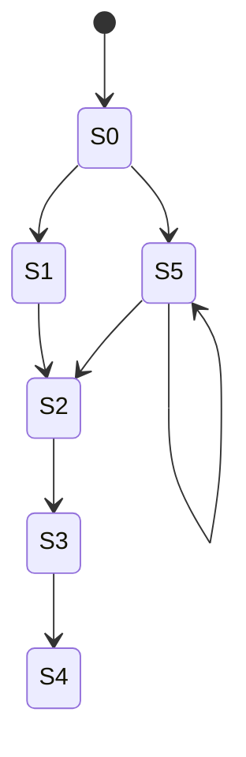

# ASIC Verification - Exercise 2 Report
**Student:** Vu Tien Giang  
**Student ID:** 2570188  

---

## 1. Exercise 2: FSM Reachability Analysis

### 1.1 Objective
Implement the State Reachability Analysis algorithm for an arbitrary Finite State Machine (FSM) using C++. The program computes the set of reachable states given a set of initial states and a transition relation.

### 1.2 Design Specifications
- **Input:** Set of initial states ($I$), and a transition relation ($R$) mapping current states to next possible states.
- **Output:** The complete set of reachable states ($ARS$ - All Reached States).
- **Algorithm Strategy:**
  - Track **All Reached States** (`ARS`) and **New Next States** (`NNS` or Frontier Set).
  - Iteratively compute the next states (`NS`) from the current frontier `NNS`.
  - Update the frontier as newly discovered states (`NNS = NS - ARS`).
  - Add the new frontier to the all reached states (`ARS = ARS U NNS`).
  - Terminate when the frontier is empty.

### 1.3 Example FSM Diagram
Consider the FSM with the following transitions:
- $S_0 \rightarrow \{S_1, S_5\}$
- $S_1 \rightarrow \{S_2\}$
- $S_5 \rightarrow \{S_5, S_2\}$
- $S_2 \rightarrow \{S_3\}$
- $S_3 \rightarrow \{S_4\}$
- $S_4 \rightarrow \emptyset$

Below is the state transition diagram rendered using Mermaid:



### 1.4 Step-by-Step Execution Trace
Starting with the initial state set $I = \{S_0\}$:

1. **Initialization:**
   - $ARS = \{S_0\}$
   - Frontier $NNS = \{S_0\}$
2. **Iteration 1:**
   - Next states from $NNS$: $NS = \{S_1, S_5\}$
   - New frontier: $NNS = NS \setminus ARS = \{S_1, S_5\}$
   - Update $ARS$: $ARS = \{S_0, S_1, S_5\}$
3. **Iteration 2:**
   - Next states from $NNS$: $NS = \{S_2, S_5\}$
   - New frontier: $NNS = NS \setminus ARS = \{S_2\}$
   - Update $ARS$: $ARS = \{S_0, S_1, S_2, S_5\}$
4. **Iteration 3:**
   - Next states from $NNS$: $NS = \{S_3\}$
   - New frontier: $NNS = NS \setminus ARS = \{S_3\}$
   - Update $ARS$: $ARS = \{S_0, S_1, S_2, S_3, S_5\}$
5. **Iteration 4:**
   - Next states from $NNS$: $NS = \{S_4\}$
   - New frontier: $NNS = NS \setminus ARS = \{S_4\}$
   - Update $ARS$: $ARS = \{S_0, S_1, S_2, S_3, S_4, S_5\}$
6. **Iteration 5:**
   - Next states from $NNS$: $NS = \emptyset$
   - New frontier: $NNS = \emptyset$
   - Frontier is empty; algorithm terminates.

---

### 1.5 C++ Implementation (`fsm_reachability.cpp`)
```cpp
#include <iostream>
#include <vector>
#include <set>
#include <map>
#include <algorithm>

// Define State as an integer for simplicity, but it can be any type
typedef int State;

// Function to compute the reachable states
// R: Next state function (Transition Relation), mapped as Current State -> Set of Next States
// I: Set of Initial States
std::set<State> Reachability(
    const std::map<State, std::set<State>>& R,
    const std::set<State>& I
) {
    // 1. ARS = NNS = I; 
    std::set<State> ARS = I;  // All Reached States
    std::set<State> NNS = I;  // New Next States (Frontier Set)

    // 2. Iterate the following computation:
    while (true) {
        std::set<State> NS; // Next States

        // 3. NS = R(all inputs, NNS);
        // Find all possible next states from the current frontier set
        for (State s : NNS) {
            if (R.find(s) != R.end()) {
                for (State next_s : R.at(s)) {
                    NS.insert(next_s);
                }
            }
        }

        // 4. NNS = NS - ARS; 
        // Find newly discovered states that haven't been reached before
        std::set<State> new_NNS;
        std::set_difference(
            NS.begin(), NS.end(),
            ARS.begin(), ARS.end(),
            std::inserter(new_NNS, new_NNS.begin())
        );
        NNS = new_NNS;

        // 5. if NNS = empty then print ARS and stop;
        if (NNS.empty()) {
            break;
        }

        // 6. ARS = ARS U NNS;
        ARS.insert(NNS.begin(), NNS.end());
    }

    return ARS;
}

int main() {
    // Example from the lecture (Explicit State Enumeration)
    // Let's create a transition relation based on a hypothetical graph
    // S0 -> {S1, S5}
    // S1 -> {S2}
    // S5 -> {S5, S2}
    // S2 -> {S3}
    // S3 -> {S4}
    // S4 -> {}
    
    std::map<State, std::set<State>> transition_relation = {
        {0, {1, 5}},
        {1, {2}},
        {5, {5, 2}},
        {2, {3}},
        {3, {4}},
        {4, {}}
    };

    std::set<State> initial_states = {0};

    std::cout << "Starting Reachability Analysis..." << std::endl;
    std::cout << "Initial States: { ";
    for (State s : initial_states) std::cout << "S" << s << " ";
    std::cout << "}\n" << std::endl;

    std::set<State> reachable_states = Reachability(transition_relation, initial_states);

    std::cout << "Final Reachable States (ARS): { ";
    for (State s : reachable_states) {
        std::cout << "S" << s << " ";
    }
    std::cout << "}\n";

    return 0;
}
```

---

### 1.6 Execution Results
```text
Starting Reachability Analysis...
Initial States: { S0 }

Final Reachable States (ARS): { S0 S1 S2 S3 S4 S5 }
```
