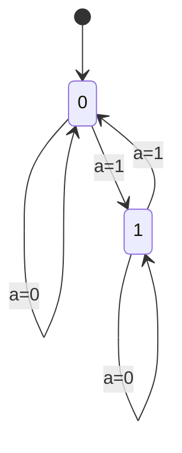
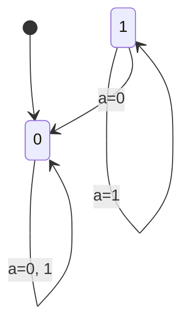
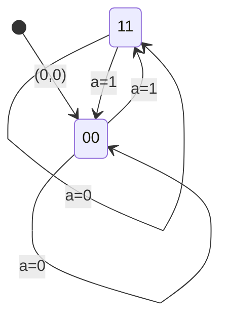

# ASIC Verification - Exercise 3 Report
**Student:** Vu Tien Giang  
**Student ID:** 2570188  

---

## 1. Exercise 3: FSM Sequential Equivalence Checking

### 1.1 Objective
The objective of this exercise is to implement and analyze the Sequential Equivalence Checking (SEC) algorithm for Finite State Machines (FSMs) using Reachability Analysis on a Shared-Input Product Machine. We verify the equivalence of two designs:
1. **Case 1:** $M_1$ versus $M_2$, both representing a T-Flip-Flop (T-FF) machine that toggles its state when the input $a = 1$ and holds its state when $a = 0$.
2. **Case 2:** $M_1$ (T-FF) versus $M_2'$ (Reset/Hold FSM), where $M_2'$ resets to state $0$ when input $a = 0$ and holds its state when $a = 1$.

### 1.2 Theoretical Background
Sequential Equivalence Checking compares the behavior of two FSMs under all possible input sequences.
Given two FSMs $M_A$ and $M_B$ sharing the same input set $I$ and output set $O$:
- **Shared-Input Product Machine ($M_C = M_A \times M_B$):**
  - State Space: $S_C = S_A \times S_B$
  - Transition Relation: $R_C((s_A, s_B), i, (s_A', s_B')) = \delta_A(s_A, i, s_A') \land \delta_B(s_B, i, s_B')$
  - Initial States: $S_{C,0} = S_{A,0} \times S_{B,0}$
- **Equivalence Condition:**
  The FSMs $M_A$ and $M_B$ are sequentially equivalent if and only if for all reachable states $(s_A, s_B)$ in the product machine, their outputs are identical:
  $$\forall (s_A, s_B) \in \text{Reachable}(M_C), \quad \lambda_A(s_A) = \lambda_B(s_B)$$
  If a reachable state $(s_A, s_B)$ exists such that $\lambda_A(s_A) \neq \lambda_B(s_B)$, the FSMs are not equivalent. The path leading to this state provides a counterexample.

---

### 1.3 Specification of the FSMs

#### FSM $M_1$ and $M_2$ (T-Flip-Flops)
- Transition: $v_i' = v_i \oplus a$ (toggles when $a=1$, holds when $a=0$).
- Output: $o_i = v_i$.
- Initial State: $v_i = 0$.



#### FSM $M_2'$ (Reset/Hold FSM)
- Transition: $v_2' = 0$ if $a=0$, and $v_2' = v_2$ if $a=1$ (resets on $a=0$, holds on $a=1$).
- Output: $o_2 = v_2$.
- Initial State: $v_2 = 0$.



---

### 1.4 Product Machine Transition Analysis

#### Case 1: $M_1 \times M_2$ (Shared-Input Product)
The shared-input product transitions for $M_1 \times M_2$ are computed using $v_1' = v_1 \oplus a$ and $v_2' = v_2 \oplus a$.

| Input ($a$) | Current State $v_1$ | Current State $v_2$ | Next State $v_1'$ | Next State $v_2'$ |
| :---: | :---: | :---: | :---: | :---: |
| 0 | 0 | 0 | 0 | 0 |
| 0 | 0 | 1 | 0 | 1 |
| 0 | 1 | 0 | 1 | 0 |
| 0 | 1 | 1 | 1 | 1 |
| 1 | 0 | 0 | 1 | 1 |
| 1 | 0 | 1 | 1 | 0 |
| 1 | 1 | 0 | 0 | 1 |
| 1 | 1 | 1 | 0 | 0 |

Reachable state transition graph:



#### Case 2: $M_1 \times M_2'$ (Shared-Input Product)
The shared-input product transitions for $M_1 \times M_2'$ are computed using $v_1' = v_1 \oplus a$ and $v_2' = a ? v_2 : 0$.

| Input ($a$) | Current State $v_1$ | Current State $v_2$ | Next State $v_1'$ | Next State $v_2'$ |
| :---: | :---: | :---: | :---: | :---: |
| 0 | 0 | 0 | 0 | 0 |
| 0 | 0 | 1 | 0 | 0 |
| 0 | 1 | 0 | 1 | 0 |
| 0 | 1 | 1 | 1 | 0 |
| 1 | 0 | 0 | 1 | 0 |
| 1 | 0 | 1 | 1 | 1 |
| 1 | 1 | 0 | 0 | 0 |
| 1 | 1 | 1 | 0 | 1 |

Reachable state transition graph:


---

### 1.5 Implementation (`fsm_equivalence.cpp`)
```cpp
#include <iostream>
#include <vector>
#include <set>
#include <map>
#include <queue>
#include <algorithm>
#include <string>

// Represents a state in the product machine: (v1, v2)
struct StatePair {
    int v1;
    int v2;

    bool operator<(const StatePair& other) const {
        if (v1 != other.v1) return v1 < other.v1;
        return v2 < other.v2;
    }

    bool operator==(const StatePair& other) const {
        return v1 == other.v1 && v2 == other.v2;
    }
};

// Transition function for M1 (T-FF)
int trans_M1(int v1, int a) {
    return v1 ^ a; // Toggles on a=1, holds on a=0
}

// Transition function for M2 (T-FF)
int trans_M2(int v2, int a) {
    return v2 ^ a; // Toggles on a=1, holds on a=0
}

// Transition function for M2' (Reset on a=0, Hold on a=1)
int trans_M2_prime(int v2, int a) {
    return (a == 0) ? 0 : v2; // Resets on a=0, holds on a=1
}

// Outputs (state is output)
int out_M1(int v1) { return v1; }
int out_M2(int v2) { return v2; }
int out_M2_prime(int v2) { return v2; }

// Perform Equivalence Checking on two FSMs
void check_equivalence(
    int (*trans1)(int, int),
    int (*trans2)(int, int),
    int (*out1)(int),
    int (*out2)(int),
    int init1,
    int init2,
    const std::string& fsm1_name,
    const std::string& fsm2_name
) {
    std::cout << "========================================\n";
    std::cout << "Checking Equivalence: " << fsm1_name << " vs " << fsm2_name << "\n";
    std::cout << "========================================\n";

    StatePair init_state = {init1, init2};
    std::set<StatePair> ARS = {init_state}; // All Reached States
    std::set<StatePair> NNS = {init_state}; // New Next States (Frontier)

    // Store the shortest input path to each state for counterexample generation
    std::map<StatePair, std::vector<int>> path;
    path[init_state] = {};

    int iteration = 1;
    bool equivalent = true;
    StatePair witness = {-1, -1};

    // Output check on initial state
    if (out1(init_state.v1) != out2(init_state.v2)) {
        equivalent = false;
        witness = init_state;
    }

    std::cout << "--- Initialization ---\n";
    std::cout << "ARS = { (" << init_state.v1 << "," << init_state.v2 << ") }\n";
    std::cout << "NNS = { (" << init_state.v1 << "," << init_state.v2 << ") }\n";

    while (equivalent && !NNS.empty()) {
        std::cout << "\n--- Iteration " << iteration++ << " ---\n";
        std::set<StatePair> NS; // Next States

        // For each state in the frontier
        for (const auto& s : NNS) {
            std::cout << "From state (" << s.v1 << "," << s.v2 << "):\n";
            // Check under all possible inputs (a = 0 and a = 1)
            for (int a = 0; a <= 1; ++a) {
                int next_v1 = trans1(s.v1, a);
                int next_v2 = trans2(s.v2, a);
                StatePair next_state = {next_v1, next_v2};
                
                std::cout << "  Input a=" << a << " -> (" << next_v1 << "," << next_v2 << ")";
                
                // If it's a newly discovered state
                if (ARS.find(next_state) == ARS.end()) {
                    NS.insert(next_state);
                    // Record path
                    std::vector<int> p = path[s];
                    p.push_back(a);
                    path[next_state] = p;
                    std::cout << " [NEW]";
                }
                std::cout << "\n";
            }
        }

        // Print NS
        std::cout << "NS = { ";
        for (const auto& s : NS) {
            std::cout << "(" << s.v1 << "," << s.v2 << ") ";
        }
        std::cout << "}\n";

        // Compute new frontier NNS = NS - ARS
        std::set<StatePair> new_NNS = NS;
        NNS = new_NNS;

        // Print NNS
        std::cout << "NNS = { ";
        for (const auto& s : NNS) {
            std::cout << "(" << s.v1 << "," << s.v2 << ") ";
        }
        std::cout << "}\n";

        if (NNS.empty()) {
            std::cout << "NNS is empty. Terminating Reachability.\n";
            break;
        }

        // Update ARS and check outputs for new states
        for (const auto& s : NNS) {
            ARS.insert(s);
            // Check if outputs differ
            if (out1(s.v1) != out2(s.v2)) {
                equivalent = false;
                witness = s;
                break;
            }
        }

        // Print ARS
        std::cout << "ARS = { ";
        for (const auto& s : ARS) {
            std::cout << "(" << s.v1 << "," << s.v2 << ") ";
        }
        std::cout << "}\n";

        if (!equivalent) {
            std::cout << "\nOutput mismatch detected in state (" << witness.v1 << "," << witness.v2 << ")!\n";
            break;
        }
    }

    std::cout << "\n--- Verification Results ---\n";
    std::cout << "All Reached States (ARS): { ";
    for (const auto& s : ARS) {
        std::cout << "(" << s.v1 << "," << s.v2 << ") ";
    }
    std::cout << "}\n";

    if (equivalent) {
        std::cout << "Result: FSM " << fsm1_name << " and " << fsm2_name << " are EQUIVALENT.\n";
    } else {
        std::cout << "Result: FSM " << fsm1_name << " and " << fsm2_name << " are NOT EQUIVALENT.\n";
        std::cout << "Difference found at state: (" << witness.v1 << "," << witness.v2 << ")\n";
        std::cout << "Counterexample input sequence: ";
        const auto& ce = path[witness];
        if (ce.empty()) {
            std::cout << "(initial states differ)";
        } else {
            for (size_t i = 0; i < ce.size(); ++i) {
                std::cout << "a=" << ce[i] << (i + 1 < ce.size() ? ", " : "");
            }
        }
        std::cout << "\n";
    }
    std::cout << "========================================\n\n";
}

int main() {
    // Case 1: M1 vs M2 (both T-FF, starting at 0, 0)
    check_equivalence(trans_M1, trans_M2, out_M1, out_M2, 0, 0, "M1", "M2");

    // Case 2: M1 vs M2' (T-FF vs Reset/Hold, starting at 0, 0)
    check_equivalence(trans_M1, trans_M2_prime, out_M1, out_M2_prime, 0, 0, "M1", "M2'");

    return 0;
}
```

---

### 1.6 Execution Results
```text
========================================
Checking Equivalence: M1 vs M2
========================================
--- Initialization ---
ARS = { (0,0) }
NNS = { (0,0) }

--- Iteration 1 ---
From state (0,0):
  Input a=0 -> (0,0)
  Input a=1 -> (1,1) [NEW]
NS = { (1,1) }
NNS = { (1,1) }
ARS = { (0,0) (1,1) }

--- Iteration 2 ---
From state (1,1):
  Input a=0 -> (1,1)
  Input a=1 -> (0,0)
NS = { }
NNS = { }
NNS is empty. Terminating Reachability.

--- Verification Results ---
All Reached States (ARS): { (0,0) (1,1) }
Result: FSM M1 and M2 are EQUIVALENT.
========================================

========================================
Checking Equivalence: M1 vs M2'
========================================
--- Initialization ---
ARS = { (0,0) }
NNS = { (0,0) }

--- Iteration 1 ---
From state (0,0):
  Input a=0 -> (0,0)
  Input a=1 -> (1,0) [NEW]
NS = { (1,0) }
NNS = { (1,0) }
ARS = { (0,0) (1,0) }

Output mismatch detected in state (1,0)!

--- Verification Results ---
All Reached States (ARS): { (0,0) (1,0) }
Result: FSM M1 and M2' are NOT EQUIVALENT.
Difference found at state: (1,0)
Counterexample input sequence: a=1
========================================
```

---

### 1.7 Analysis and Conclusions
- **M1 vs. M2:** Reachability analysis completes in two iterations. The set of reachable states is $ARS = \{(0,0), (1,1)\}$. In both states, the state variables are equal ($v_1 = v_2$), producing identical outputs. Hence, the two machines are **sequentially equivalent**.
- **M1 vs. M2':** The reachability analysis discovers state $(1,0)$ in the first iteration under input $a = 1$. In this state, output of $M_1$ is $1$ while that of $M_2'$ is $0$. This mismatch immediately terminates the search, showing that $M_1$ and $M_2'$ are **not equivalent**. The input sequence $a = 1$ serves as the counterexample.
